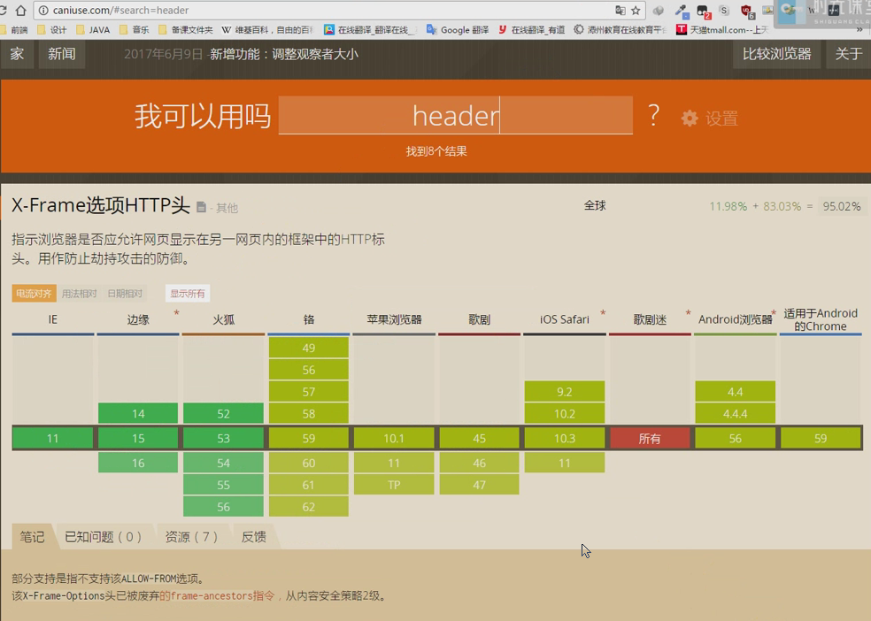
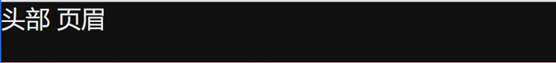
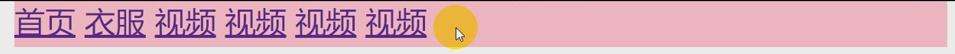

# HTML5 简介 + 标签

### 简介

HTML5 万维网的核心语言、标准通用标记语言下的一个应用，超文本标记语言的第五次重大修改。HTML5 将成为 HTML、XHTML 以及 HTML DOM 的新标准。

目的是为了在移动设备上支持多媒体

### 规则

1. 新特性应该基于HTML、CSS、DOM 以及 JavaScript。
2. 减少对外部插件的需求（比如 Flash）
3. 更优秀的错误处理
4. 更多取代脚本的标记
5. HTML5 应该独立于设备
6. 开发进程应对公共透明

---

1. 语义特性
  * `div`
  * `ul` `li`
  * `nav`
  * `header`
  * `footer`
2. 本地存储特性
  * 本地存储功能
  * 更快启动和联网
3. 设备的兼容特性
  * 直接调用摄像头
  * 视屏影音
4. 连接特性
  * 直接推送服务器数据到客户端
5. 网页的多媒体支持
  * 支持网页端的 `audio`、`vidoe` 等多媒体标签
6. 三维图形以及特效
  * 基于 `svg`、`canvas` 3D 功能
  * 如：烟花、小星星
7. 性能
  * 在不牺牲语义结构的情况下提供了更强的特效
8. CSS 特性

### 浏览器标识

* `-webkit-(attr)`
  - Chrome
  - Safari
  - Edge
  - Sogou
  - QQ
  - 360
* `-moz-(attr)`
  - Firefox
* `-o-(attr)`
  - Opera
* `-ms-(attr)`
  - IE

---

### 课外内容

[http://caniuse.com/#search=header](http://caniuse.com/#search=header)
[
    
]

---

### HTML5 结构标签

`style.css`
``` css
* { margin: 0; padding: 0; }
.clearfix{ clear: both; }
.clear-fix:after { content: ''; display: block; clear: both; }
```

> **规定头部、页眉**

`header` `html`
``` html
<header>头部 页眉</header>
```
`css`
``` css
body { font: 40px '微软雅黑'; color: white; }
header { height: 100px; background-color: black; }
```


---

> **导航**

`nav` `html`
``` html
<nav>
  <a>首页</a>
  <a>衣服</a>
  <a>视频</a>
  <a>视频</a>
  <a>视频</a>
  ...
</nav>
```
`css`
``` css
nav {width: 1220px; height: 60px; background: pink; margin: auto;}
```


---

> **定义页面中独立的内容（文章，帖子，新闻）**

`article` `html`
``` html
<!-- 定义页面中独立的内容 -->
<article class='box clear-fix'>article</article>
```
`css`
``` css
article { width: 300px; height: 500px; background: red; float: left; }
```

---

> **页面局部区域**

`section` `html`
``` html
<!-- 定义文档中独立区域 -->
<section class='clear-fix'>
  <!-- 标题标签的组合 -->
  <hgroup>
    <h2>title 1</h2>
    <h3>title 2</h3>
  </hgroup>
  section
</section>
```
`css`
``` css
section { width: 500px; height: 500px; background: #f3f; float: left; }
```

---

> **标题标签的组合**

`hgroup` `html`
``` html
<!-- 标题标签的组合 -->
<hgroup>
  <h2>title 1</h2>
  <h3>title 2</h3>
</hgroup>
```

---

> **定义独立的流内容**

`figure` `html`
``` html
<!-- 组合标签 figure 与 figcaption 一起使用 -->
<figure>
  <!-- 图的标题 -->
  <figcaption>这是天猫的广告</figcaption>
  
</figure>
```
`css`
``` css
figure { width: 600px; height: 300px; background: #666; }
```

---

> **定义侧边栏**

`aside` `html`
``` html
<!-- 定义侧边栏 -->
<aside>aside</aside>
```
`css`
``` css
aside { width: 100px; height: 300px; background: #06f; position: fixed; bottom: 0; right: 0; }
```

---

> **文档底部**

`footer` `html`
``` html
<!-- 文档底部 -->
<footer>footer</footer>
```
`css`
``` css
footer { height: 200px; background: #000; }
```

### 特殊结构标签

> **重点显示**

`mark` `html`
``` html
<!-- 重点显示 -->
<p>老师<mark>好帅啊！</mark></p>
```
`css`
``` css
mark { background: red; width: 100px; height: 100px; border: 1px solid blue; }
```

---

> **注释**

`ruby` `html`
``` html
<!-- 注释 -->
<ruby>槑
  <rt>mei
    <rp>mei</rp>
  </rt>
</ruby>
```

---

> **尺度、进度**

`meter` `html`
``` html
<!-- 尺度、进度 -->
<!--
  min ：数值，最小值
  max ：数值，最大值
  value ：数值
  low ：数值，低
  high ：数值，高
 -->
<meter min='0' max='100' value='50' low='20' high='80'></meter>
```
`css`
``` css
meter { background: red; }
```

---

> **进度条**

`progress` `html`
``` html
<!-- 进度条 -->
<!--
  min ：数值，最小值
  max ：数值，最大值
  value ：数值
 -->
<progress min='0' max='1' value='0.5'></progress>
```
`css`
``` css
progress { width: 400px; height: 50px; }
```

---

> **对话框**

`dialog` `html`
``` html
<!-- 对话框 -->
<dialog open>
  <p>你好啊</p>
  <p>你好</p>
</dialog>
```

---

> **描述文档的细节部分**

`details` `html`
``` html
<!-- 描述文档的细节部分 -->
<details>
  <summary>木马老师</summary>
  <p>帅气迷人 风流倜傥</p>
</details>
```
`css`
``` css
details { width: 300px; border: 1px solid red; }
```

---

### 低版本兼容

`[if lt IE version] ... ![endif]` `html`
``` html
<!--[if lt IE 9]-->
  IE 9 以下版本
<!--[!endif]-->
```
`IE 兼容` `html`
``` html
<!--
  inline
 -->
<header>头部</header>
<nav>
  <a href="javascript: void(0);">首頁</a>
  <a href="javascript: void(0);">視頻</a>
  <a href="javascript: void(0);">保健平</a>
  <a href="javascript: void(0);">食品</a>
</nav>
<section>section</section>
```
`css`
``` css
* { margin: 0; padding: 0; }
body { font: 12px '微软雅黑'; color: white; }
header { height: 100px; background: black; display: block; }
nav { width: 1220px; height: 200px; background: pink; margin: auto; display: block; }
section { height: 150px; background: #6cf; display: block; }
```
`js`
``` js
document.createElement("header");
document.createElement("nav");
document.createElement("section");
```
